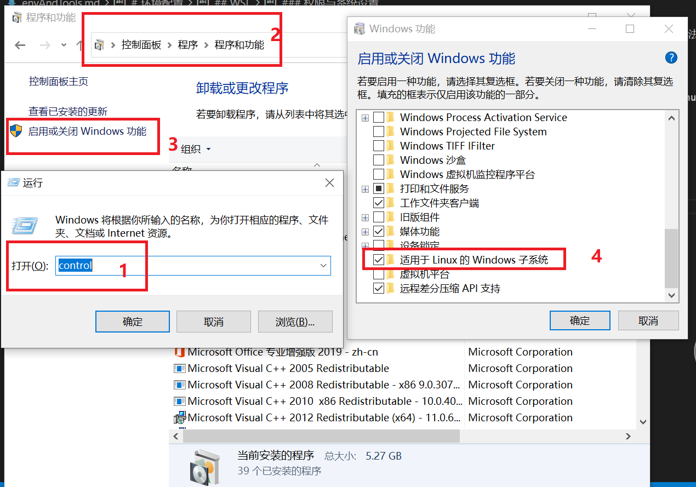
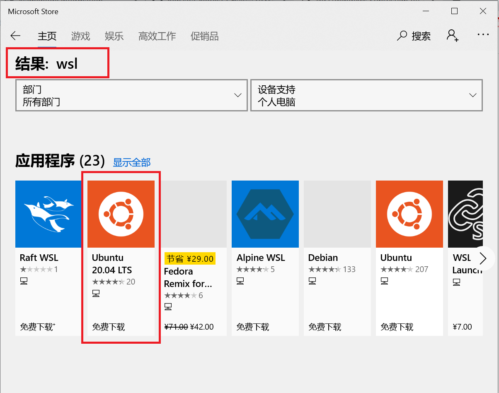

# 环境配置
大数据环境的大部分工具需要在Linux环境下运行，而日常办公的PC主机主要为Windows操作系统，测试环境下可以使用四种方法：
* 虚拟机：安装删除便捷，容易多节点部署，但是运行速度及打开速度较慢，占用主机资源较多
* 双系统：需要划分磁盘空间给双系统，当需要使用Windows下的绘图或通讯工具，常需要在Windows和Linux系统之前切换，
* 购置服务器：服务器提供商提供了足够的性能，但文件传输不易，偶见SSH产生延迟影响工作效率
* （推荐方法）使用WSL（Windows Subsystem for Linux），windows子系统，在Windows环境下直接使用命令行形式的Linux系统，安装删除快，能够直接访问Windows下的文件。本项目主操作系统使用Ubuntu20.04。

## WSL
### 环境要求
WSL需要将操作系统升级到Win10
### 权限与系统设置
* 首先需要启动Windows的对于WSL的支持

* 重启电脑
* 在Windows商店中搜索“WSL”并选择安装，当下选择的是Ubuntu20.04

* 安装完成后能够直接在菜单中选择“Ubuntu20.04”，或者在命令行输入“wsl”、“bash”打开默认的子系统
