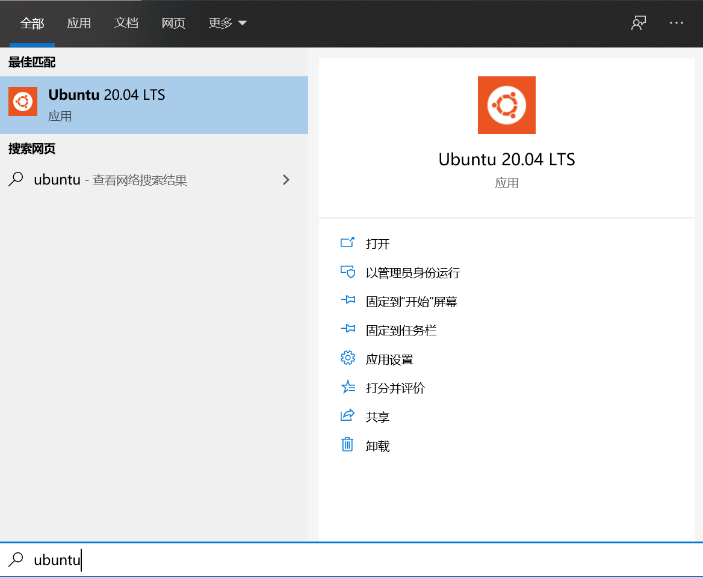

# 环境配置
大数据环境的大部分工具需要在Linux环境下运行，而日常办公的PC主机主要为Windows操作系统，测试环境下可以使用四种方法：
* 虚拟机：安装删除便捷，容易多节点部署，但是运行速度及打开速度较慢，占用主机资源较多
* 双系统：需要划分磁盘空间给双系统，当需要使用Windows下的绘图或通讯工具，常需要在Windows和Linux系统之前切换，
* 购置服务器：服务器提供商提供了足够的性能，但文件传输不易，偶见SSH产生延迟影响工作效率
* （推荐方法）使用WSL（Windows Subsystem for Linux），windows子系统，在Windows环境下直接使用命令行形式的Linux系统，安装删除快，能够直接访问Windows下的文件。本项目主操作系统使用Ubuntu20.04。

## WSL
### 环境要求
WSL需要将操作系统升级到Win10
### 权限与系统设置
* 首先需要启动Windows的对于WSL的支持

* 重启电脑
* 在Windows商店中搜索“WSL”并选择安装，当下选择的是Ubuntu20.04

* 安装完成后能够直接在菜单中选择“Ubuntu20.04”，或者在命令行输入“wsl”、“bash”打开默认的子系统
* 这里有个小技巧，可以直接在点win键后出现的菜单页面中输入ubuntu，win10能够搜索已安装应用


### 修改软件镜像源
由于国内网络访问限制，于是需要修改软件镜像源以提高网络下载速度，在此使用[清华大学镜像源](https://mirror.tuna.tsinghua.edu.cn/help/ubuntu/)

1. 先备份系统默认的源设置文件，并修改，在此如果不熟悉vi，可以使用nano来修改相关文件
```
sudo cp /etc/apt/sources.list /etc/apt/sources.list.bak
sudo vi /etc/apt/sources.list
```
2. 将source文件配置成如下文本：
```
# 默认注释了源码镜像以提高 apt update 速度，如有需要可自行取消注释
deb https://mirrors.tuna.tsinghua.edu.cn/ubuntu/ focal main restricted universe multiverse
# deb-src https://mirrors.tuna.tsinghua.edu.cn/ubuntu/ focal main restricted universe multiverse
deb https://mirrors.tuna.tsinghua.edu.cn/ubuntu/ focal-updates main restricted universe multiverse
# deb-src https://mirrors.tuna.tsinghua.edu.cn/ubuntu/ focal-updates main restricted universe multiverse
deb https://mirrors.tuna.tsinghua.edu.cn/ubuntu/ focal-backports main restricted universe multiverse
# deb-src https://mirrors.tuna.tsinghua.edu.cn/ubuntu/ focal-backports main restricted universe multiverse
deb https://mirrors.tuna.tsinghua.edu.cn/ubuntu/ focal-security main restricted universe multiverse
# deb-src https://mirrors.tuna.tsinghua.edu.cn/ubuntu/ focal-security main restricted universe multiverse
```
3. 更新apt
```
sudo apt update
```